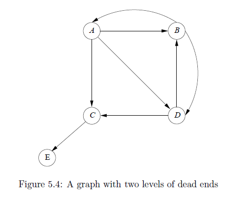

# Algorithm Data Science assignments

Assignments for the course **Algorithm Data Science** offered by the Master's program in *Data Science and Machine Learning* of the National Technical University of Athens

Many of the exercises are from the book [Mining of Massive Dataset](http://www.mmds.org/).

Assignment 1 is not very heavy on programming. Assignment 2 doesn't involve any programming at all.
