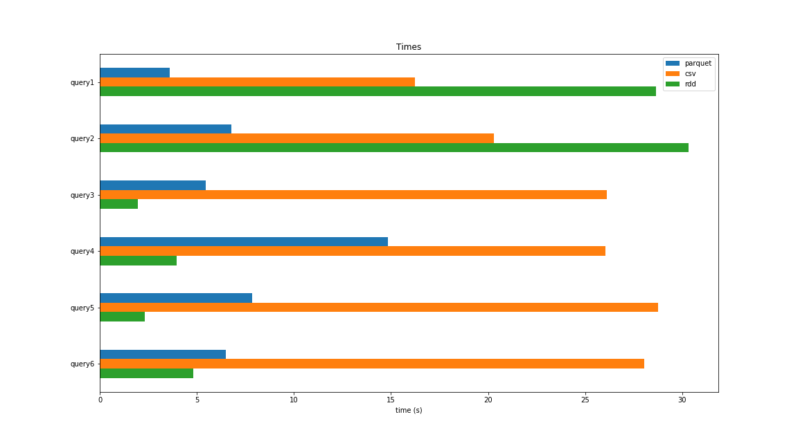

# Spark SQL and MapReduce

Project for the **Big Data** course, part of the Master's program in *Data Science and Machine Learning* offered by the National Technical University of Athens.

We implement 6 queries with Spark's **SQL** and **MapReduce** APIs. The implementation of the queries can be found in [main.ipynb](main.ipynb).

For a detailed description of the project requirements in Greek see [description-greek.pdf](description-greek.pdf). Answers to the requirements in Greek can be found in [report-greek.pdf](report-greek.pdf). 

## The Dataset

The dataset consists of Spotify's top charts and it can be downloaded from [this link](http://www.cslab.ece.ntua.gr/~nprov/courses/spotify_data.tar.gz). It is composed of 4 csv files (`artists.csv`, `chart_artist_mapping.csv`, `charts.csv`, `regions.csv`). The fields of these csv files can be seen in [csv_to_parquet.py](csv_to_parquet.py), which creates parquet files from the csv files, so that they can be used efficiently with Spark's SQL/DataFrame API.

## Queries

The queries to be implemented are

1. Find the total number of streams for the song *Shape of You* according to the *top200* charts.
2. For each chart, for each song, for each country, find the number of days that the song was in position #1. Then take the average over all countries (69 in total, no need to compute it). Return the song with the maximum average.
3. For each year, for each month, find the average daily streams of the song which is at the number 1 position in the *top200* charts. Order the results by year and month.
4. For each country, find the song(s) with the most days in the *viral50* charts. Order the results by country name and by song name.
5. For each year, find the artist with the the highest average streams over all countries (69 countries, no need to compute it) for the *top200* charts.
6. For each year, for each chart, find the artist(s) with the most consecutive days in position number 1 in Greece. Order by chart and by year.
