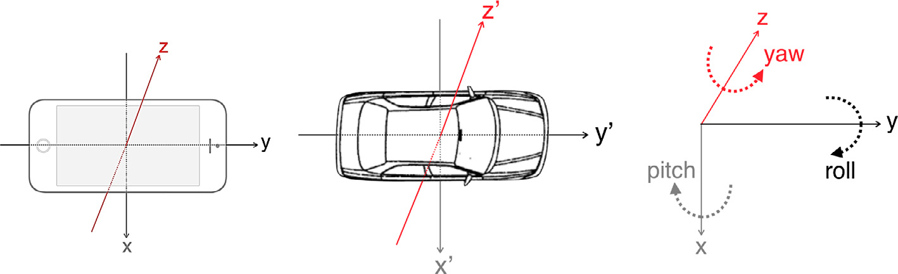

# Data-driven models in Engineering Applications

Projects for the course **Data-Driven Models in Engineering Applications** offered by the Master's program in *Data Science and Machine Learning* of the National Technical University of Athens.

The contents of the projects are summarized below:

0. A small exercise on random walks.
1. Karhunen–Loève expansion on Gaussian processes. Spectral representation on Gaussian processes.
2. Monte-Carlo simulations of heat diffusion.
3. Extreme turning movements detection of vehicles with the use of smartphone accelerometer and gyroscope data.
